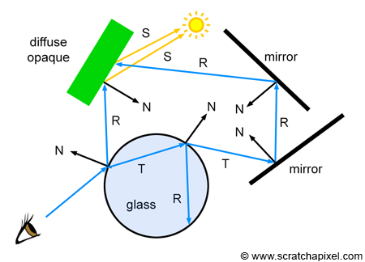

# 前置知识

**光学：**

光照射到物体表面时，会被物体表面**吸收、反射和折射**

反射一般包括两个方面：漫反射（diffuse reflection）和镜面反射（specular reflection）。

辐射通量、辐射率等概念自行google。

# 什么是光线追踪技术

光线追踪技术与光栅化技术是两种主要的渲染技术。光线追踪要和光栅化技术放在一起讨论。

光线追踪技术，简单来说，就是将摄像机投射平面上的最终图像划分为多个像素，从视点向每个像素发射射线，针对每条射线，遍历场景中的物体找到交点，再计算交点处的颜色（即Shading）。

光栅化技术，则是针对场景中每个物体的面片，将其投射到摄像机投射平面上成像，再对每个像素进行颜色计算（Shading）。

这是两种渲染场景的不同方式。

光线追踪技术主要包括以下两种具体实现方式：

1. 前向追踪（forward ray-tracing）

定义：即追踪从光源发射出的多条射线的路径，计算那些最终进入眼睛的光线颜色。

优点：与自然状况下光源的发射、传播一致。

缺点：只有少数射线最终能够进入眼睛，产生光感。大量没进入眼睛的射线会增加计算量。同时很难确定要从光源处发射多少射线，才能保证射线都能照射到自己关注的物体上，如场景中的茶壶等。

2. 后向追踪（backward ray-tracing）

定义：追踪从眼睛发出的射线的路径，路径最终到达光源处，然后再求出每小段路径上光的强度，最终得到进入眼睛的光线颜色；

优点：计算量减少，且效果也很不错。

# 光线追踪技术的优缺点

优点：

光线追踪：

1. 处理场景物体的可见性，以及Shadering，都是用同一套逻辑就可以实现。而且不需要像光栅化渲染一样，需要针对阴影进行特殊处理（如去实现一个shadow map之类的步骤）。

缺点：

光线追踪：

1. 需要将所有物体的面片都加在到内存中，即使有一些物体不会出现在视野里（因为他们也可能阻挡光线从而生成阴影，所以不可以直接被裁减掉）
2. 需要对所有面片都进行光线-几何体碰撞计算，且计算复杂度较高。
3. 无法进行背向面剔除等操作。
4. 计算光线和场景中物体的交点的计算量较大。

# 光线传播算法Whitted Light-Transport Algorithm

定义：现在很多人在介绍光线追踪技术时，实际上都是在介绍光线传播算法，如本博客要讲的Whitted Light-Transport Algorithm。

> Ray-tracing is a technique for computing the visibility between points. Light transport algorithms are designed to simulate the way light propagates through space 

光线传播算法是基于光线追踪技术的一种算法，可以用来模拟场景中光线的传播，进而渲染出场景。

主要算法实现过程如下：

1. 如光线追踪算法，从每个像素发射一条射线，光线与场景中的物体进行碰撞检测。

2. 选取离视点最近的碰撞点为可视点。

3. 获取可视点的颜色信息。

   

   根据可视点所在表面材质的不同，要分三种情况进行处理。

+ 材质为透明材质，即可镜面反射、可折射的类型

  如上图，光线碰到玻璃球的时候，会发生反射和折射。所以视点的光源应该有两种。

  具体的计算可分为三个步骤：

  1. 计算反射颜色
  2. 计算折射颜色
  3. 使用菲涅尔方程（Fresnel equation）得到上述两种颜色混合的比例，从而得到最终结果的颜色。菲涅尔方程需要用到材质的折射系数。

+ 材质为镜面材质，即只会发生镜面反射的类型

  这一种类型处理起来最为简单，因为可以获取到一条反射光线，这条光线如果射向光源，则可以直接用光源计算。如果不射向任何物体，则默认为黑色或为指定的颜色。

+ 材质为遮罩、漫反射类型，即只会发生漫反射的类型

  这一种类型最为简单。可以采用常见的光照模型来进行渲染，如phong光照模型。

  在具体实现中，可以直接用光源进行计算，不考虑其他物体表面反射的光对可视点的影响。（按理说应该要将其他物体表面反射的光考虑进去才是，但是这样计算量和编程难度会增加很多）

**注意：上面第1、2种材质，反射的光线可能会碰撞到场景中其他物体，折射的光线也是如此，这样我们就可以用递归的方式来继续求这些光线的强度，直到找到光源或者超过了递归的最高层数。**

# Whitted Light-Transport Algorithm不完善的地方

考虑光线在场景中多次反射、折射，在这种情况下，场景中所有物体都可以成为光源。

像灯泡这类物体，它是有体积的，但是我们可以认为他是一个点光源，因为他向各个方向发射的光的强度都是一致的。

但如果灯泡的光照射到场景中的物体，如塑料小球，那么塑料小球的表面也会反射这些光，这时候，塑料小球就是一个光源，但我们不能简单地认为它也是一个点光源。因为根据材质的不同（即BRDF函数），塑料小球表面上的任意一点反射到任意方向的光线强度都不一定相同。这时候我们可以认为塑料小球是无数多个点光源的集合。且这些点光源发射到不同方向的光颜色都不相同。

如果按这样考虑，就相当于场景中有无数点光源，且物体表面所形成的点光源，在不同方向上的光强都不相同。

更为致命的是，这些无数点光源会照亮其他物体，形成更多点光源。且点光源之间光线会相互影响。

这样比如我们在计算像素是否会落在阴影中时，就要考虑这么多个点光源了，这是一个很复杂的问题。

算法中，如漫反射类型材质的shading，只考虑了光源，没有考虑其他物体反射的光（即其他物体作为光源）的影响。

感觉处理起来最为麻烦的就是具有漫反射性质的材质，而这又是最普遍存在的材质。对漫反射类型的某个特定顶点进行着色计算时，任何方向的光源都对这个顶点有影响，也就是说其他物体漫反射、镜面反射、折射的光都会对他起作用。很多时候这是不能被忽略掉的，但在本算法中似乎被简化了。

# 基于光线追踪的更完善的光线传播算法

1. path-tracing
2. bidirectional path-tracing
3. Metropois light transport algorithms
4. Distributed Ray-Tracing(Robert L. Cook  1984)

# 相关论文、博客、教程

[An Overview of the Ray-Tracing Rendering Technique](https://www.scratchapixel.com/lessons/3d-basic-rendering/ray-tracing-overview/light-transport-ray-tracing-whitted)

An Improved Illumination Model for Shaded Display  **Turner Whitted** 1979 

Some Techniques for Shading Machine Renderings of Solids **Appel**  1969 

